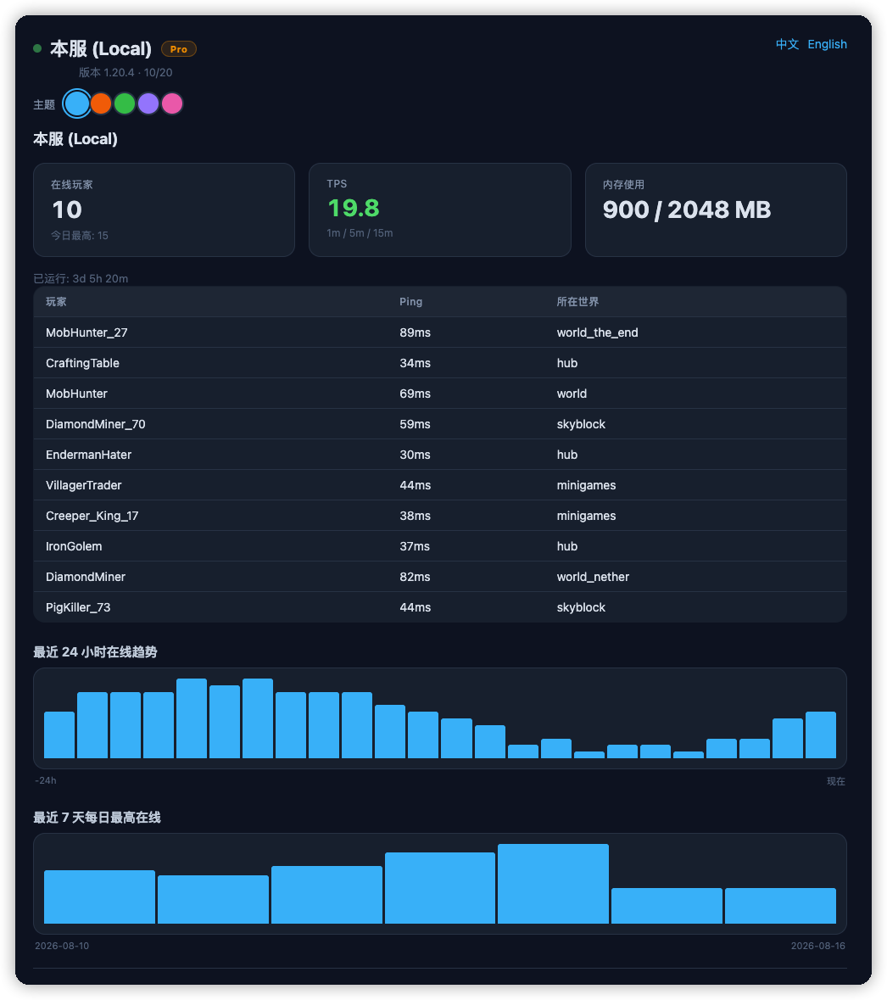
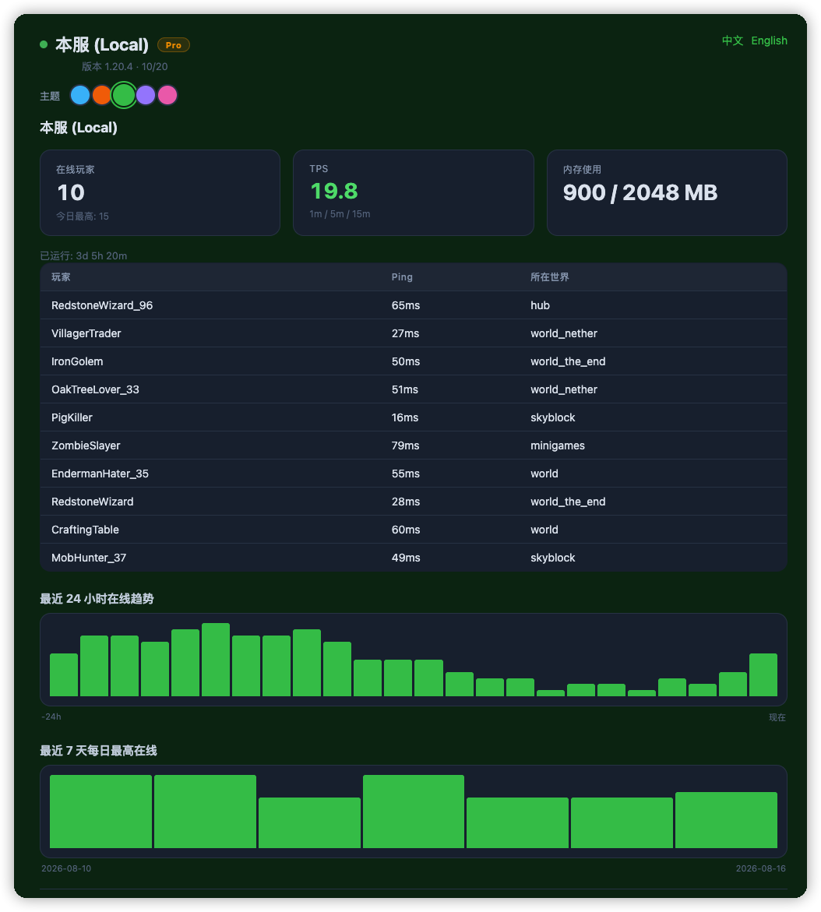
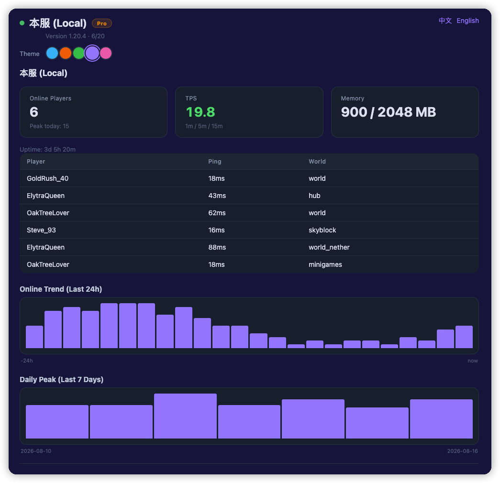
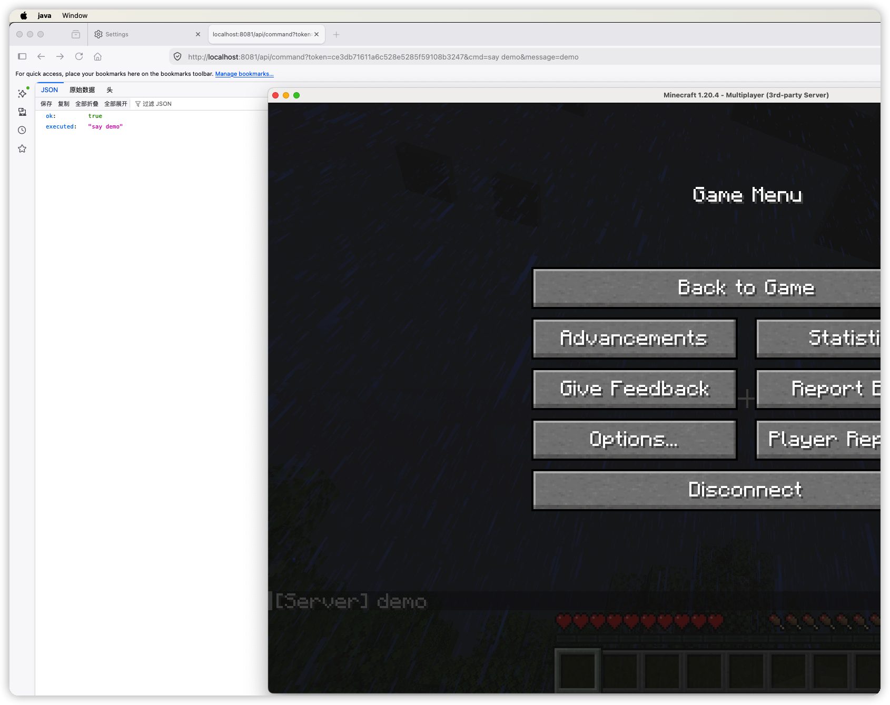
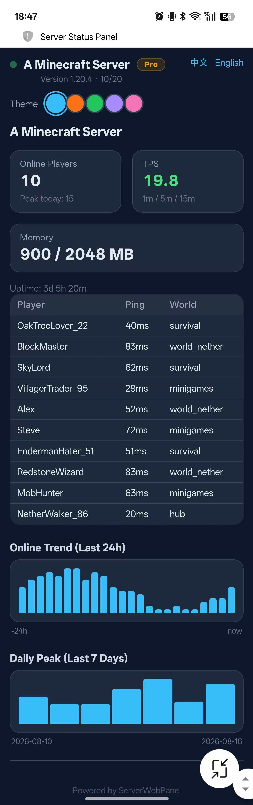

# ServerWebPanel

**A modern, real-time web dashboard for your Paper server.** See who's online, monitor TPS & memory, and track player trends — right from your browser, on any device. No login required for visitors.

  

---

## 📥 Download

**Free version:** grab `ServerWebPanel-Free.jar` from this repository (click the file, then the **Download** button).
**Pro version:** coming soon (BuiltByBit) — remote command API, one-click themes, Discord webhooks, multi-server view.

---

## ✨ Features

### Free version
- 🌐 **Public live page** — server status, online players (name/ping/world), TPS, memory, uptime
- 📈 **24-hour online trend** chart (auto-sampled every 30s)
- 📅 **7-day daily peak** chart — data survives restarts & crashes (auto-saved every 5 min)
- 🌍 **Chinese & English** UI with auto-detection (`?lang=en` / `?lang=zh` to switch)
- 🔒 **Zero config needed** — drop the jar in and it works (default port `8081`)

### Pro version (all Free features +)
- ⚡ **Remote command API** — send broadcasts, whitelist/ban players from your phone or scripts, protected by a token + command whitelist
- 🎨 **One-click themes** — switch the whole page theme from the browser; applies to all visitors instantly, no restart
- 🔔 **Discord webhook notifications** — server start/stop alerts + low-TPS warnings
- 🖥️ **Multi-server support** — watch several servers on one page
- 🏷️ **Custom branding** — page title, accent/background colors, footer

| | Free | Pro |
|---|---|---|
| Live status page | ✅ | ✅ |
| Player list (ping/world) | ✅ | ✅ |
| 24h / 7d charts | ✅ | ✅ |
| Remote command API | ❌ | ✅ |
| One-click themes | ❌ | ✅ |
| Discord webhooks | ❌ | ✅ |
| Multi-server view | ❌ | ✅ |
| Custom branding | ❌ | ✅ |

## 🖼️ Screenshots











## 📦 Requirements

- **Paper** 1.20+ (Spigot works for the core page; TPS uses the Paper API)
- **Java 17+**
- The web page runs **inside the server** — the panel is online whenever your server is online (like Dynmap)

## 🚀 Installation

1. Download the jar (Free or Pro)
2. Drop it into your server's `plugins/` folder
3. Restart the server
4. Open `http://<your-server-ip>:8081` in any browser

> **Port 8081** is the default because 8080 is often taken by other services. Change it in `plugins/ServerWebPanel/config.yml`.

## ⚙️ Configuration (`plugins/ServerWebPanel/config.yml`)

```yaml
port: 8081                # web page port
bind-address: 0.0.0.0     # 0.0.0.0 = everyone can access
token: ""                 # admin token (auto-generated if empty)
sample-interval-seconds: 30

# Commands allowed through the remote API (whitelist!)
allowed-commands:
  - "say %message%"
  - "broadcast %message%"
  - "whitelist add %player%"
  - "whitelist remove %player%"
  - "ban %player%"
  - "pardon %player%"

pro: true                 # Pro build only — see below

theme:
  presets:
    Ocean:  { accent: "#38bdf8", background: "#0f172a" }
    Fire:   { accent: "#f97316", background: "#1c1917" }
    Forest: { accent: "#22c55e", background: "#052e16" }
    Purple: { accent: "#a78bfa", background: "#1e1b4b" }
    Candy:  { accent: "#f472b6", background: "#500724" }

webhook:
  enabled: false
  url: ""                  # Discord webhook URL
  tps-threshold: 15.0
  alert-cooldown-minutes: 10

remote-servers: []         # multi-server: [{name, url}]
```

## 🔧 Commands & Permissions

| Command | Description | Permission |
|---|---|---|
| `/panel` | Show panel URL, token & online count | everyone |
| `/panel token` | Regenerate the admin token | `serverwebpanel.admin` (default: op) |
| `/panel reload` | Reload config | `serverwebpanel.admin` |

## 🔌 Web API (Pro)

### Public
| Endpoint | Description |
|---|---|
| `GET /api/status` | Full status JSON (online, tps, memory, players, charts) |
| `GET /api/servers` | Server list (local + remotes) |
| `GET /api/theme` | Theme presets + active theme |

### Admin (requires `?token=` or header `X-Auth-Token`)
| Endpoint | Description |
|---|---|
| `GET /api/command?cmd=...&message=...` | Execute a whitelisted command |
| `GET /api/theme/set?preset=Fire` | Switch theme (applies to all visitors) |

```bash
# Broadcast a message from your phone:
curl "http://your-server:8081/api/command?token=YOUR_TOKEN&cmd=say%20hello&message=hello"
# Expected: {"ok":true,"executed":"say hello"}
```

## ❓ FAQ

- **Page won't open?** Check the port isn't blocked by a firewall; for remote access open TCP 8081.
- **Data lost after crash?** Stats auto-save every 5 minutes — at most 5 minutes lost.
- **How to switch Free/Pro?** The two builds ship with different defaults; you can also toggle `pro:` in config (e.g. to trial Pro before buying).
- **Is a visitor login required?** No — the status page is public by design; admin actions require the token.

## 📜 Changelog

**v1.3.0**
- Professional UI overhaul: player avatars, server icon, TPS health colors, live status dot, version & max-players display, chart time labels
- `/icon` endpoint serves your `server-icon.png`

**v1.2.0**
- One-click theme switcher on the page (Pro) — applies to all visitors, no restart
- Theme presets (5 built-in) + custom accent/background config
- Free/Pro dual builds via Maven profile (`-Pfree`)

**v1.1.0**
- Remote command API with token auth + command whitelist
- Discord webhook notifications (start/stop, low-TPS alerts)
- Multi-server support
- Custom branding (title, colors, footer)

**v1.0.0**
- First release: live status page, player list, TPS/memory, 24h & 7d charts, zh/en UI

## 📬 Support

Issues, feature requests and commissions welcome. If you need a custom plugin, I build Minecraft plugins on commission — contact me via the resource page or Discord.
